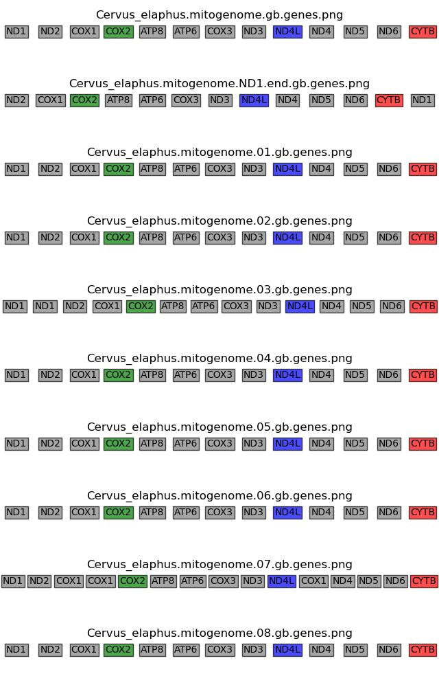

# Intro  
This program takes in a list of genbank files and draws a plot containing the graphical representation of their genes in the correct order.  

This script has been tested in the context of mithocondrial genome sequences, therefore it's been tested with up to 20 genes per sequence. If you are working with a larger number of genes it's possible that the final plot won't look great. In that case you need to manually adjust the `draw_textBoxes.py` script. 

# Requirements
Python3 and the following packages:   
* Biopython
* matplotlib
* numpy
* PIL

# How to run
```
python draw_textBoxes.py <target_gbk_files>
```

Where <target_gbk_files> is a text file containing the target genbank files to be processed, e.g.: 

```
seq1.gb
seq2.gb
seq3.gb
```

Note:   
If a genbank file is not in the current working directory, you need to specify the path to the file. 

# Test
A `tests/` directory is provided for you to test the installation. 

Go to that directory and run the script: 
```
python ../draw_textBoxes.py target_files.txt
```

This should generate a `all_seqs.png` file, that looks like:  



